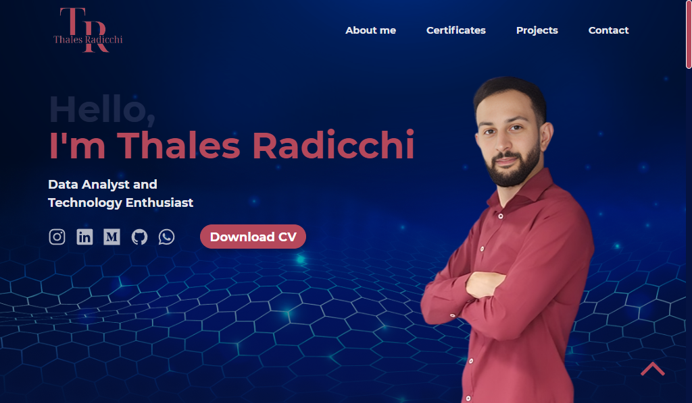

<h1 align="center"> PortFolio </h1>

Todos os direitos são detidos para em prol do Thales Radicchi, não é permitido a cópia, salvo a autorização.

  <a href="#-tecnologias">Tecnologias</a>&nbsp;&nbsp;&nbsp;|&nbsp;&nbsp;&nbsp;
  <a href="#-projeto">Projeto</a>&nbsp;&nbsp;&nbsp;|&nbsp;&nbsp;&nbsp;
  <a href="#-layout">Layout</a>&nbsp;&nbsp;&nbsp;|&nbsp;&nbsp;&nbsp;

 

  

## 🚀 Tecnologias

Esse projeto foi desenvolvido com as seguintes tecnologias:

- HTML e CSS
- JavaScript
- Git e Github
- Figma

## 💻 Projeto

O Personal Portfolio é um meio de comunicar com o mundo os meus pensamentos, e como posso ser visto através dos meus conceitos (valor e deveres).

## 🔖 Layout

Você pode visualizar o layout do projeto através [DESSE LINK](<https://www.figma.com/file/meFGz8aImGGcB9fekx0WLc/Thales's-Portfolio?type=design&t=GYuv06Vk42ukqoeN-6>). É necessário ter conta no [Figma](https://figma.com) para acessá-lo.

---